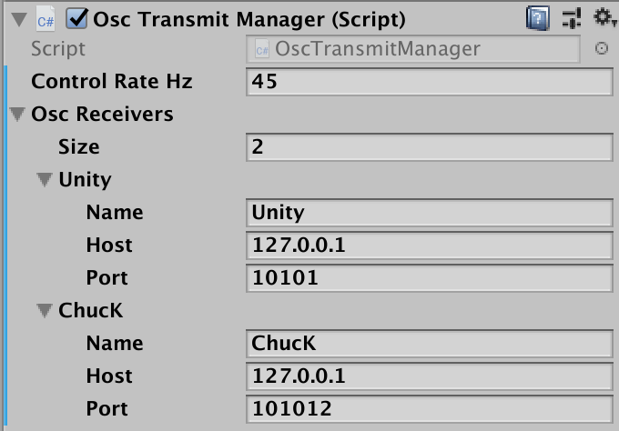

# UnityOscLib
### A simple Open Sound Control (OSC) library for Unity

UnityOscLib is designed to simplify the process of adding [OSC](http://opensoundcontrol.org/introduction-osc) capabilities to Unity applications. It builds on the Core OSC C# classes of Jorge Garcia's [UnityOSC library](https://github.com/jorgegarcia/UnityOSC) but simplifies the configuration process through the Unity Inspector or through C# scripting.  

To add OSC support to any Unity application simply add the `OSCManagers` prefab to the game heirarchy and configure as needed. This prefab includes scripts for both sending OSC messages, as well as, receiving OSC messages.  More details on each script are below.

To see an example of UnityOscLib in action, open the `ExampleScene` in the Examples folder and review the `OSCManagers GameObject`.  Attached to this `GameObject` is a script called `OscTests` that shows examples for sending and receiving messages using `UnityOscLib`.

UnityOscLib was built to support the new [OSC-XR toolkit](https://github.com/fortjohnson/osc-xr) for building immersive music control environments.

Developed and Tested on Unity 2018.3.2f1

## OSC Transmission

### The Osc Transmit Manager

#### Configuration

1. Add the `OscTransmitManager` to any persistent GameObject in the main Unity scene (or simply add the `OscManagers` Unity prefab to the scene).
2. Configure 1 or more Osc Receivers by entering a name, the receiver's host address and its listening port
3. Configure the transmission control rate.
   - By default the transmit manager sends OSC messages using Unity `FixedUpdate` function using the default frame rate of the Unity application.  This can be modified using the transmit manager's control rate parameter.  

#### Sending OSC Messages

UnityOscLib provides two functions for sending OSC messages. (Since `OscTransmitManager` implements a Unity Singleton pattern, the current transmit manager instance can be accessed using `OscTransmitManager.Instance`)

1. To send an OSC message to all configured OSC receivers use:
   - `public void SendOscMessageAll(string oscAddress, params object[] values)`
   - `OscTransmitManager.Instance.SendOscMessageAll("/osc/address/", 1.1, "stringValue")`
2. To send an OSC message to one of the configured OSC receivers use:
   - `public void SendOscMessage(string name, string address, params object[] values)`
   - `OscTransmitManager.Instance.SendOscMessage("ChucK", "/osc/address/", 1.1, "stringValue")`

## Receiving OSC Messages

More to come...