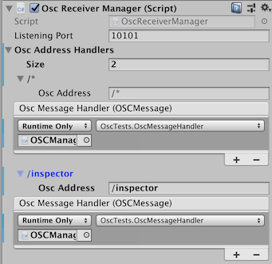

# UnityOscLib
### A simple Open Sound Control (OSC) library for Unity

UnityOscLib is designed to simplify the process of adding [OSC](http://opensoundcontrol.org/introduction-osc) capabilities to Unity applications. It builds on the Core OSC C# classes of Jorge Garcia's [UnityOSC library](https://github.com/jorgegarcia/UnityOSC) but simplifies the configuration process through the Unity Inspector or through C# scripting.  

To add OSC support to any Unity application simply add the `OSCManagers` prefab to the game heirarchy and configure as needed. This prefab includes scripts for both sending OSC messages, as well as, receiving OSC messages.  More details on each script are below.

To see an example of UnityOscLib in action, open the `ExampleScene` in the Examples folder and review the `OSCManagers GameObject`.  Attached to this `GameObject` is a script called `OscTests` that shows examples for sending and receiving messages using `UnityOscLib`.

UnityOscLib was built to support the new [OSC-XR toolkit](https://github.com/fortjohnson/osc-xr) for building immersive music control environments.

Developed and Tested on Unity 2018.3.2f1

## Transmitting OSC Messages

### The Osc Transmit Manager


#### Public Methods and Members

```csharp
// Property that returns the currently instantiated OscTransmitManager instance
public static OscTransmitManager Instance;
```

```csharp
// Adds a new OSC Receiver to the receiver dictionary
public void AddReceiver(string name, string host, int port);
```

```csharp
// Sends an OSC message with the specified OSC address and zero or
// more parameter values to all OSC receivers.
public void SendOscMessageAll(string oscAddress, params object[] values);
```

```csharp
// Sends an OSC message with the specified OSC address and zero or
// more parameter values to the specified OSC receiver.
public void SendOscMessage(string name, string address, params object[] values);
```

```csharp
// Public event for adding methods that send OSC messages at the
// configured control rate
public event SendOsc OnSendOsc;
```

### Configuration

1. Add the ```OscTransmitManager``` to any persistent GameObject in the main Unity scene (or simply add the ```OscManagers``` Unity prefab to the scene).
2. Configure one or more Osc Receivers by entering a name, the receiver's host address and its listening port.
   - Alternatively, use the `AddReceiver` method to configure a receiver

### Sending OSC Messages

UnityOscLib provides two methods for sending OSC messages. Since `OscTransmitManager` implements a Unity Singleton pattern, the current transmit manager instance can be accessed using `OscTransmitManager.Instance`

1. To send an OSC message to all configured OSC receivers use `SendOscMessageAll`:

    ```csharp
    OscTransmitManager.Instance.SendOscMessageAll("/osc/address/", 1.1, "stringValue")
    ```

2. To send an OSC message to one of the configured OSC receivers use `SendOscMessage`:

    ```csharp
    OscTransmitManager.Instance.SendOscMessage("ChucK", "/osc/address/", 1.1, "stringValue")
    ```

### Configuring the OSC Control Rate

Typically to send OSC messages you may want to simply send in your main applications `Update` or `FixedUpdate` methods.  These methods, however, provide limited configuration of the control rate outside of updating the main frame rate.  Instead, UnityOscLib offers an `OnSendOsc` delegate event to handle methods that send OSC messages.  

1. Implement a `void` method that takes no parameters.  The method should call one of the two methods for sending OSC messages.
2. Add the method to the `OnSendOsc` event:

    ```csharp
    OscTransmitManager.Instance.OnSendOsc += OscMethod;
    ```

3. Configure the control rate in the Unity Inspector interface.  (By default `OnSendOsc` runs at the `FixedUpdate` frame rate but this can be overridden by setting the desired value in the inspector.)

## Receiving OSC Messages

### The Osc Receiver Manager



#### Public Methods and Members

```csharp
// Property that returns the currently instantiated OscReceiverManager instance
public static OscReceiverManager Instance;
```

```csharp
// Method to register an OSC callback for a specified OSC address.
// The handler method should be a void method that accepts an
// OSCMessage as a parameter
public void RegisterOscAddress(string oscAddress, UnityAction<OSCMessage> handler);
```

### Configuration

1. Configure the port to listen for incoming messages on.
2. Optionally, configure OSC Handlers through the inspectors (see the next section)

### Handling OSC Messages

`UnityOscLib` provides two ways to register OSC message handlers, in the Inspector or through the scripting interface. (Currently, `UnityOscLib` only implements exact OSC address matching.  More advanced OSC address matching is planned for a future iteration.)

To Configure in the Inspector:

1. Increase the OSC Address Handlers list size by the number of handlers you are adding
2. Enter the OSC Address to handle
3. Select the GameObject that contains the handler function
4. Select the handler function from the GameObject

To Configure through the Scripting Interface:

1. Create a void method that accepts an OSCMessage and processes the message as needed.
2. Register an OSC address with the corresponding handler method using the `RegisterOscAddress` method.
